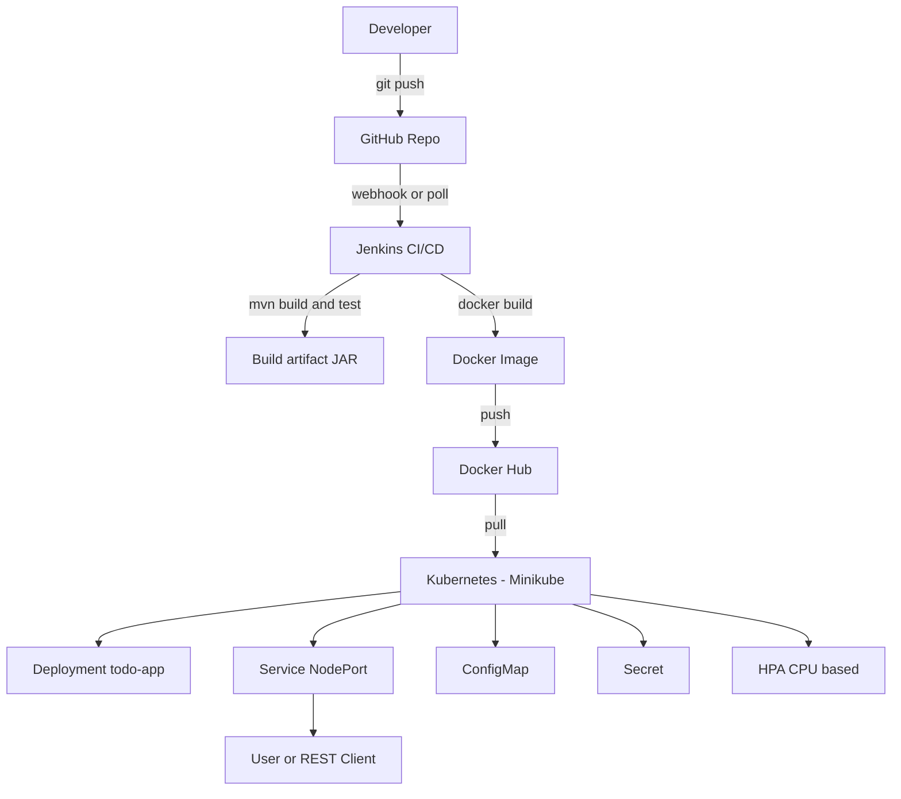

# DevOps Final Project — ToDo App  
**Jenkins · Docker · Kubernetes · Ansible**

## Overview
This repository demonstrates a production-oriented DevOps pipeline for a Spring Boot **ToDo** application:

- CI/CD pipeline implemented with **Jenkins**
- Containerization using **Docker**
- Deployment to **Kubernetes (Minikube)**
- Infrastructure automation with **Ansible (roles + vault)**

---

## Architecture

### High-level Architecture Diagram

Key Components

Jenkins — builds, tests, and pushes Docker images

Docker Hub — stores versioned images (BUILD_NUMBER-SHORT_COMMIT, latest)

Kubernetes (Minikube) — runs the application using ConfigMap, Secret, probes, and HPA

Repository Structure
Jenkinsfile                   # CI/CD pipeline
Dockerfile_BakhitbekovAibatyr  # Multi-stage Docker build
k8s/                           # Kubernetes manifests
k8s/ansible/                   # Ansible automation (roles, playbooks, vault)

Step-by-Step Setup (Linux VM)
Prerequisites

Ubuntu 24.04

Docker

Jenkins (system service)

Minikube (Docker driver)

kubectl

Ansible + kubernetes.core collection

1) Clone Repository
git clone https://github.com/Aibatyr11/DevOps_mini_task2
cd DevOps_mini_task2

2) Jenkins (CI/CD)

Create a Pipeline job in Jenkins

Connect it to this GitHub repository

Add credentials:

Docker Hub credentials (ID: dockerhub-creds)

Run Build Now and verify success

3) Kubernetes (Minikube)
minikube start --driver=docker
kubectl config use-context minikube

kubectl apply -f k8s/configmap.yaml
kubectl apply -f k8s/secret.yaml
kubectl apply -f k8s/deployment.yaml
kubectl apply -f k8s/service.yaml
kubectl apply -f k8s/hpa.yaml

Check status:

kubectl get pods -o wide
kubectl get svc
kubectl get hpa

Get service URL:

minikube service todo-app-service --url

CI/CD Pipeline Flow

Checkout — generates dynamic image tag

Build — Maven build, artifact archived

Test — pipeline fails if tests fail

Docker Build — tags: dynamic + latest

Docker Push — pushes image to Docker Hub

Deploy (optional) — only on main branch

Verification Evidence
Jenkins

Successful pipeline execution

Docker image pushed to Docker Hub

Kubernetes
kubectl get pods -o wide
kubectl get svc
kubectl get hpa

Application Endpoint
curl http://<MINIKUBE_IP>:30081/
